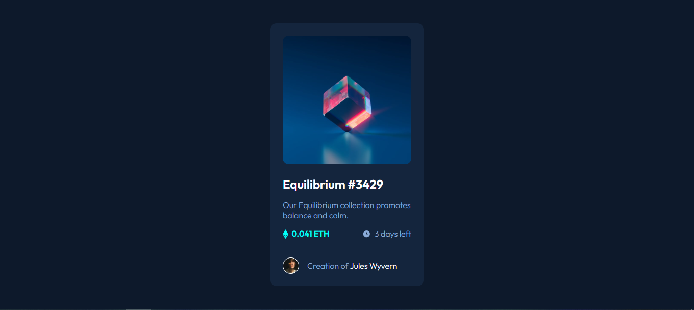
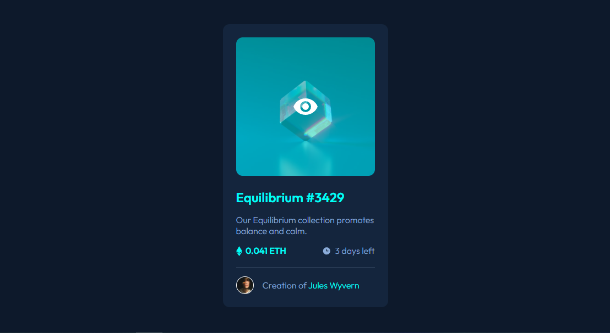
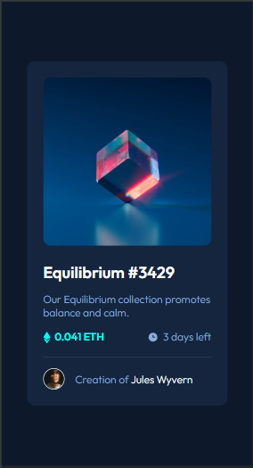

# Frontend Mentor - NFT preview card component solution

This is a solution to the [NFT preview card component challenge on Frontend Mentor](https://www.frontendmentor.io/challenges/nft-preview-card-component-SbdUL_w0U). Frontend Mentor challenges help you improve your coding skills by building realistic projects. 

## Table of contents

- [Overview](#overview)
  - [Screenshot](#screenshot)
  - [Links](#links)
- [My process](#my-process)
  - [Built with](#built-with)

## Overview

### Screenshot

#### Desktop

#### Active

##### Mobile View

### Links

- Solution URL: [URL Repository](https://github.com/JulianMont/NTF-Card-Component)
- Live Site URL: [Live site URL](https://julianmont.github.io/NTF-Card-Component/)

## My process

### Built with

- Semantic HTML5 markup
- CSS custom properties
--CSS Nesting
- Flexbox
- CSS Grid
- Mobile-first workflow

